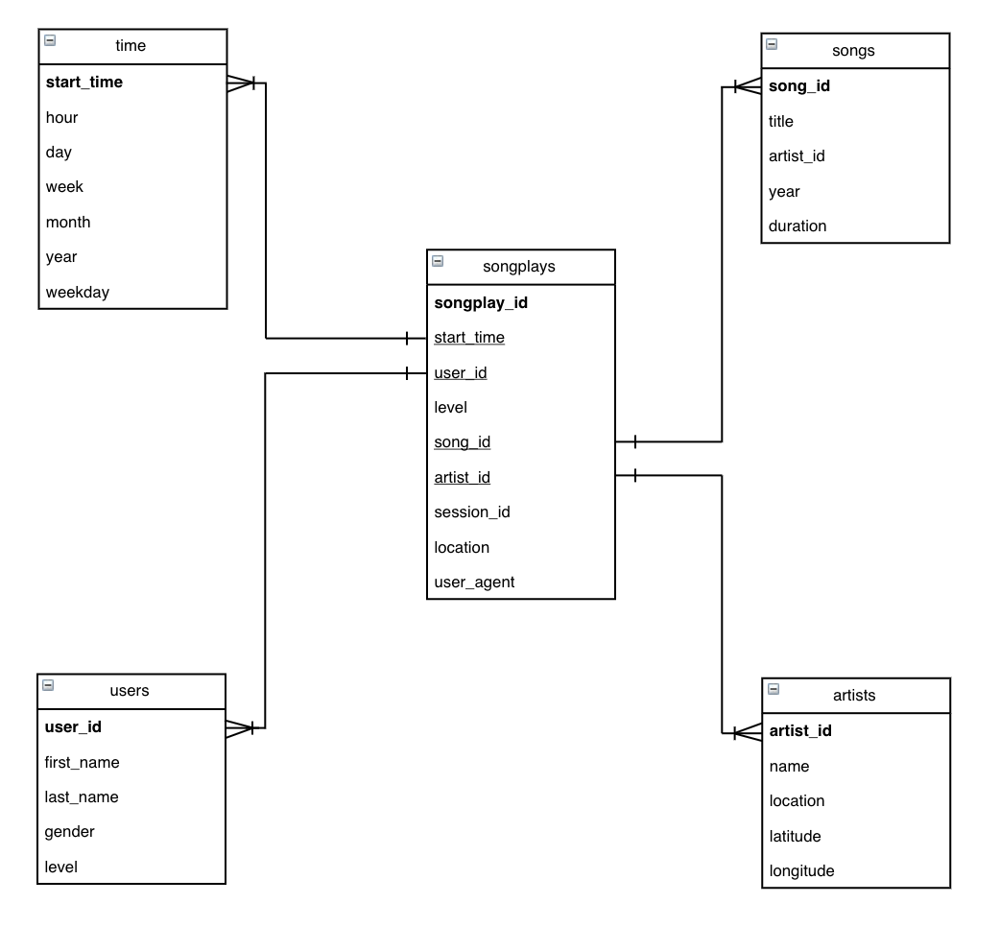

# Project 3: Implementing a Cloud Data Warehouse
In this project, logs and songs data are extracted from s3 and staged in Redshift, before being inserted into dimensional tables for Sparkify's analytics purposes.

## Structure
The files located in this repository are listed below:
- create_tables.py: Python script that will create tables upon executed.
- etl.py: Python script that will execute the ETL pipelines.
- sql_queries.py: Python script that contains all the SQL queries.
- dwh.cfg: Configuration file that contains relevant information on the Redshift cluster, IAM ROLE and s3 data path.

## Database Schema
The final database schema used for Sparkify's analytical purposes will follow a star schema design, as it is denormalised and hence, optimised for analytical queries. 

## Process
An overview of the ETL process is as follows:
1. `create_tables.py` drops existing tables using the SQL queries in `sql_queries.py` and the AWS configuration info found in `dwh.cfg`.
2. `create_tables.py` creates the required tables using the SQL queries in `sql_queries.py` and the AWS configuration info found in `dwh.cfg`.
3. `etl.py` stages the data from s3 to Redshift using the SQL queries in `sql_queries.py` and the AWS configuration info found in `dwh.cfg`.
4. `etl.py` loads the data staged in Redshift into the analytical database using the SQL queries in `sql_queries.py` and the AWS configuration info found in `dwh.cfg`.
